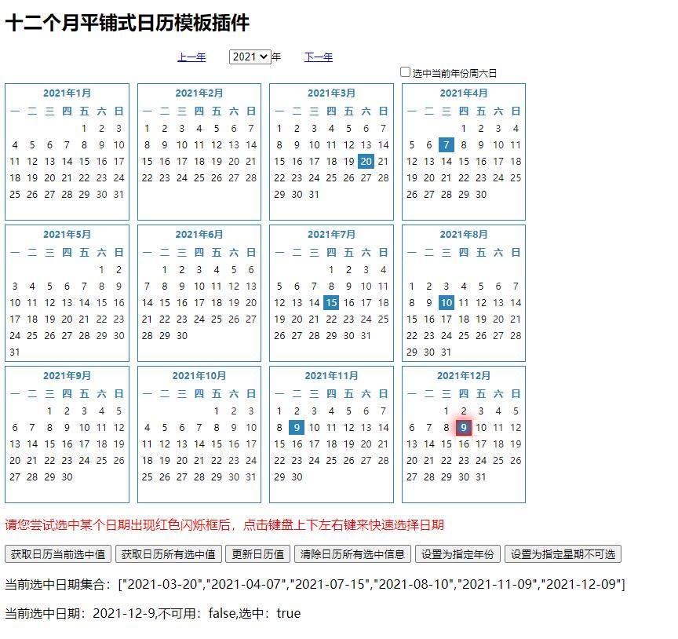

### 主要功能
- [x] 一键全选周六日
- [x] 年份切换自动保存上个年份选择的日期
- [x] 一键获取日历所有选中值
- [x] 一键获取当前日历选中值
- [x] 跳转到指定年
- [x] 指定日期不可选择
- [x] 一键清理所有选中日历
- [x] 只读模式
- [x] 日历年份范围

### 支持事件
- [x] 当前日期选中回调
- [x] 当前年份所有选中的日期的回调

### 截图

